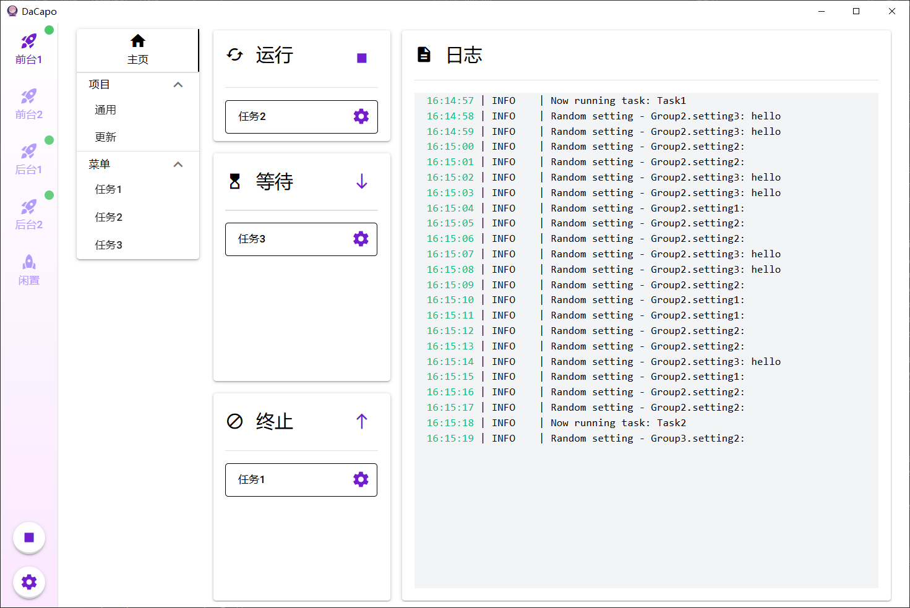

  中文 | [English](docs/README_en.md)

  

  <h3 align="center">DaCapo</h3>

  

    一个配置文件为驱动的图形化脚本管理器
  

## 简介

本项目旨在为有繁杂用户配置的程序提供图形化界面，开发者无需编写额外代码，只需按特定要求提供和使用配置文件，即可为自己的程序创建GUI。同时对于用户而言，可以将多个程序脚本集中管理，很适合一些需要周期性执行的任务。

## 亮点

- 通过 JSON/YAML 格式的配置文件生成GUI
- 一键管理和运行多个任务实例
- 自动从远程仓库拉取代码并创建界面
- 自动管理python虚拟环境并更新依赖
- 支持多语言

## 使用指南

如何使我的程序适配DaCapo？ 👉 [开发者指南](./docs/开发者指南.md)

如何使用DaCapo？ 👉 [用户指南](./docs/用户指南.md)

**示例：**

1. [DaCapoDemo](https://github.com/Aues6uen11Z/DaCapoExample)：一个简单的入门示例
2. [HonkaiHelper](https://github.com/Aues6uen11Z/HonkaiHelper)：崩坏3自动化脚本
3. [DaCapo-SRC-Adapter](https://github.com/Aues6uen11Z/DaCapo-SRC-Adapter)：崩坏：星穹铁道自动化脚本，依赖StarRailCopilot但无需下载本体
4. [GameSripts](https://github.com/Aues6uen11Z/GameScripts)：原神、绝区零自动化脚本，依赖BetterGI和ZenlessZoneZero-OneDragon，未适配需要下载本体

## 安装

#### 获取发布版

你可以到[这里](https://github.com/Aues6uen11Z/DaCapo/releases)下载最新的发布版，直接点击可执行文件使用。

#### 从源码构建

1. 按照[安装说明](https://wails.io/docs/gettingstarted/installation/)准备好Go、NPM、WebView2、Wails等依赖，直至`wails doctor`命令显示一切就绪。
2. 克隆本项目。
3. 在根目录执行`wails build`。

## 致谢

[SRC](https://github.com/LmeSzinc/StarRailCopilot)/[ALAS](https://github.com/LmeSzinc/AzurLaneAutoScript)：一切的开始，本项目参考了其页面布局和配置文件方式。

[Wails](https://wails.io/)：比Electron更轻量的打包工具，将web项目转换为PC客户端。
