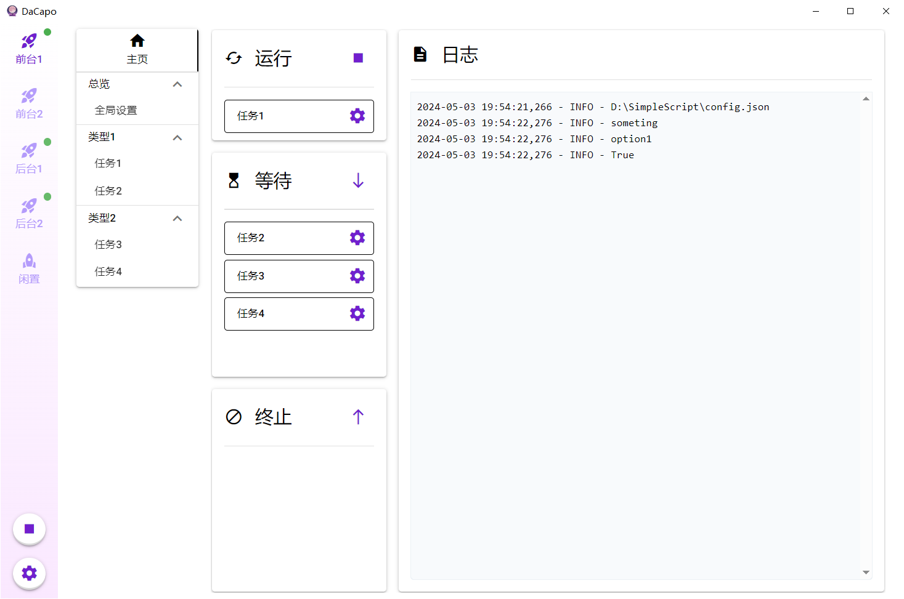

  简体中文 | [English](docs/README_en.md)

  

  <h3 align="center">DaCapo</h3>

  

    一个配置文件为驱动的图形化脚本管理器
  

## 简介

本项目旨在为有繁杂用户配置的程序提供图形化界面，开发者无需编写额外代码，只需按特定要求提供和使用配置文件，即可为自己的程序创建GUI。同时对于用户而言，可以将多个程序脚本集中管理，很适合一些需要周期性执行的任务。

## 亮点

- 通过 JSON/YAML/TOML 格式的配置文件生成GUI
- 一键管理和运行多个任务实例
- 自动从远程仓库拉取代码并创建界面
- 自动管理python虚拟环境并更新依赖
- 支持多语言

## 使用指南

如何使我的程序适配DaCapo？ 👉 [开发者指南](./docs/开发者指南.md)

如何使用DaCapo？ 👉 [用户指南](./docs/用户指南.md)

**示例：**

1. [SimpleScript](./examples/SimpleScript)：顾名思义，一个简单的入门示例
2. [HonkaiHelper](https://github.com/Aues6uen11Z/HonkaiHelper)：崩坏3自动化脚本

## 安装

#### 获取发布版

你可以到[这里](https://github.com/Aues6uen11Z/DaCapo/releases)下载最新的发布版，目前仅支持Windows系统，解压后点击DaCapo.exe即可运行。

#### 从源码构建

新建Python3.6以上版本虚拟环境，安装`requirements.txt`的依赖包，执行`main.py`即可，应该没什么坑。

## 致谢

[NiceGUI](https://github.com/zauberzeug/nicegui)：本项目使用的GUI库，功能灵活强大，维护者十分友善且回复极快，社区也非常活跃。

[niceguiToolkit](https://github.com/CrystalWindSnake/nicegui-toolkit)：一个NiceGUI辅助工具，作者也是很乐于助人，其教程和答疑让我受益匪浅，B站/微信公众号同名：数据大宇宙，学NiceGUI找他就对了！

[SRC](https://github.com/LmeSzinc/StarRailCopilot)/[ALAS](https://github.com/LmeSzinc/AzurLaneAutoScript)：一切的开始，本项目仿照了其页面布局和配置文件方式。

[Nuitka](https://github.com/Nuitka/Nuitka)：本项目使用的打包工具。
