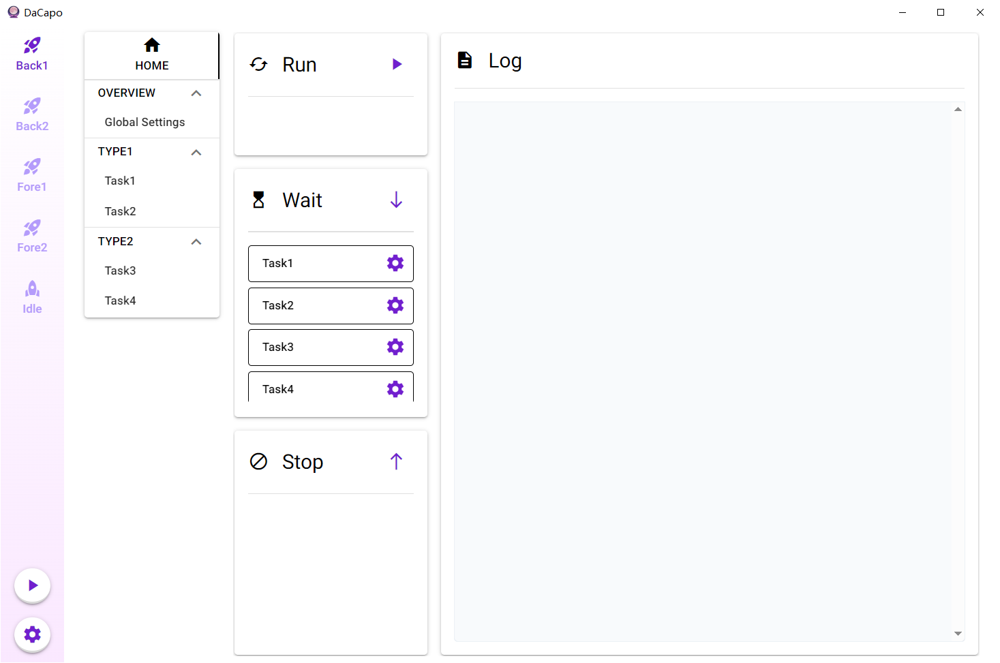
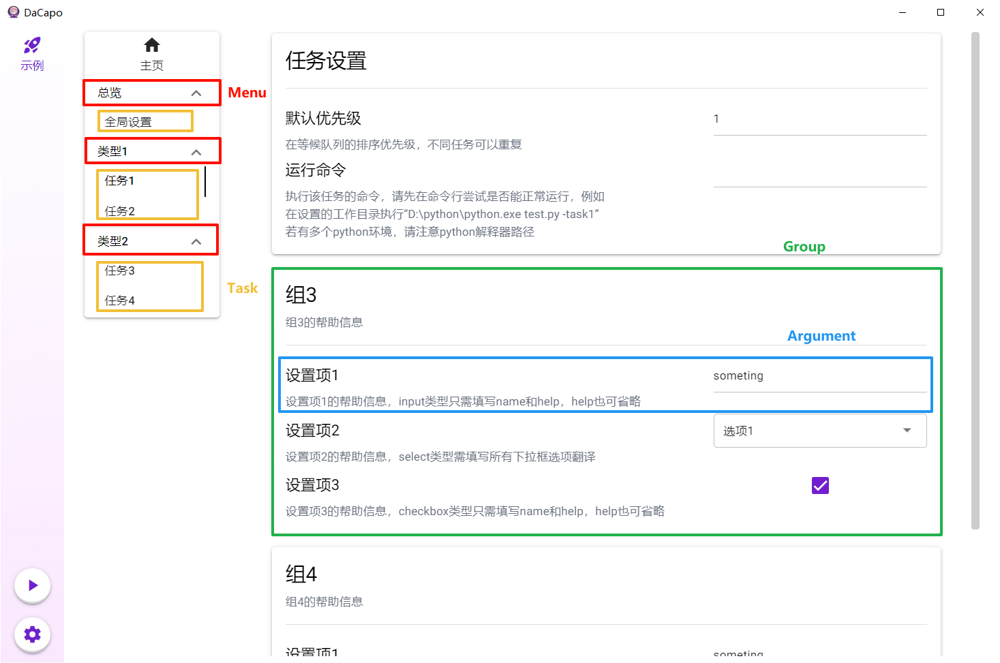
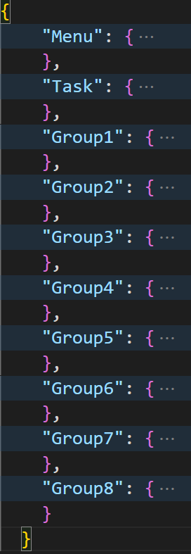
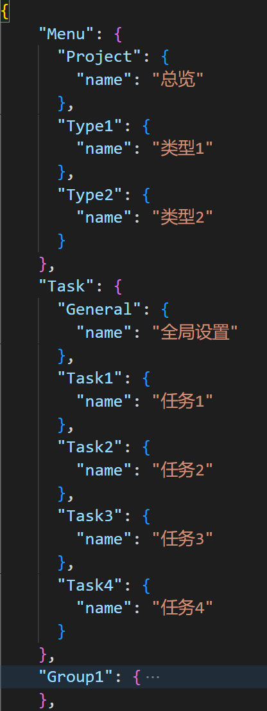
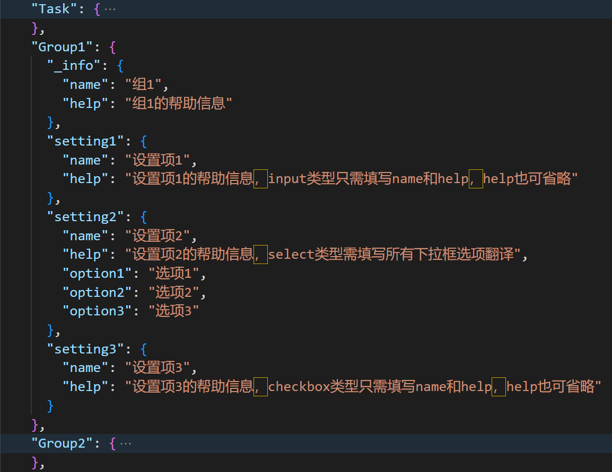
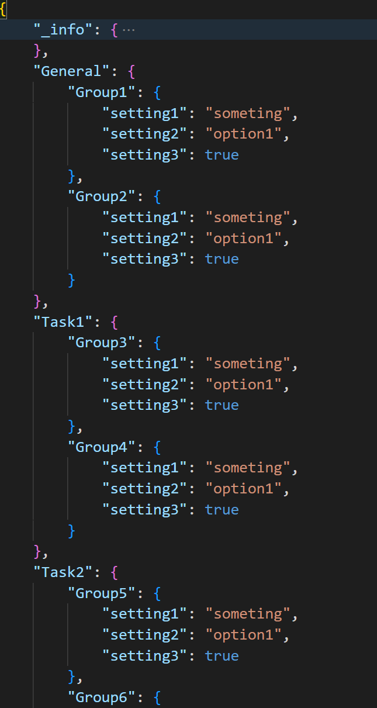

<div align="center">

  [简体中文](../README.md) | English

  <a></a>

  <h3 align="center">DaCapo</h3>

  <p align="center">
    A graphical script manager driven by configuration files
  </p>
</div>

<details>
  <summary>Table of Contents</summary>
  <ol>
    <li><a href="#Introduction">Introduction</a></li>
    <li><a href="#Execution-strategy">Execution Strategy</a></li>
    <li>
      <a href="#Getting Start">Getting Start</a>
      <ul>
        <li><a href="#Preparation">Preparation</a></li>
        <li><a href="#Installation">Installation</a></li>
        <li><a href="#Adding-configuration">Adding Configuration</a></li>
        <li><a href="#Global-settings">Global Settings</a></li>
        <li><a href="#Task-settings">Task Settings</a></li>
        <li><a href="#Start-running">Start Running</a></li>
      </ul>
    </li>
    <li><a href="#Usage-examples">Usage Examples</a></li>
    <li><a href="#Acknowledgements">Acknowledgements</a></li>
  </ol>
</details>

## Introduction

This project aims to provide a graphical interface for programs with complex user configurations. Developers do not need to write additional code, but only need to provide and use JSON configuration files according to specific requirements to create a GUI for their programs. At the same time, for users, it allows for centralized management of multiple program scripts, which is very suitable for tasks that require periodic execution.



## Execution Strategy

Each option in the left sidebar is referred to as an instance. An instance can contain several tasks, which currently execute in order of priority without automatic management scheduling.

When there are multiple instances, they can be executed with a single click. At this point, all foreground instances execute sequentially, while background instances execute concurrently. The term foreground and background instances refers to whether the tasks contained in the instance require screen, keyboard, and mouse devices, and whether they can be executed completely in the background.

## Getting Start

### Preparation

Before you start using it, you need to provide a configuration template that includes the content to be generated. In a configuration directory, `args.json` must be included, while `i18n` can be omitted. Specifically, the structure should look like this:

```
----Template/		# Dirname is not import
    |----args.json
    |----i18n/
         |----zh-CN.json
         |----en-US.json
         |----......
```

#### args.json

This file contains all the configuration content that needs to be generated, divided into 4 levels, representing task groups, tasks, option groups, and options, respectively, with **tasks** being the units of command execution.

The first task group is used for overall settings, which **must** include a “General” task, and none of the tasks in the first task group will enter the execution queue. You should place the settings for tasks you want to execute in the subsequent task groups.

The `argument` option currently supports 3 types: `input` for text input fields, `select` for dropdown menus, and `checkbox` for check boxes.

> Note that DaCapo does not provide data validation for the content of input fields, and you will need to handle possible exceptions within your own program.

```
menu
├── task
│   ├── group
│   │   ├── argument
│   │   │   ├── type: "select"
│   │   │   ├── value: "example"
│   │   │   ├── option: ["this", "is", "an", "example"]
│   │   │   └── ...
```



#### i18n

This directory contains parameter translations and help information. If you provide only one language but still want to write some help information, you can create a JSON file of this kind, leaving `name` empty and filling in only `help`. The JSON file for each language is organized as follows:

- The first level consists of the Menu task group, Task tasks, and all Group option groups.



- The second level consists of translations for the names of task groups and tasks for Menu and Task.



- For Group, it includes not only the translation of the Group itself ($_info) but also the translations of all its setting items. If a setting item is a dropdown menu, then all options are translated at the same level as name and help.




Next, your program should accept a JSON configuration file. This time, the task group level is omitted, and the hierarchy is `Task` - `Group` - `Argument`, as follows:




### Installation

#### Obtain the Release Version
You can download the latest release version [here](https://github.com/Aues6uen11Z/DaCapo/releases). Currently, only Windows systems are supported. After extracting the files, click on DaCapo.exe to run the application.

#### Building from Source Code
Create a Python virtual environment with version 3.6 or higher, install the dependencies listed in `requirements.txt`, and then execute `main.py`. There shouldn’t be any major issues.


### Adding Configuration

Once the program is open, click on the gear icon to enter the settings page. At the “Add New Instance” section, choose “Import,” and select the template directory mentioned in the [Preparation](#preparation) section.

> Note: Do not navigate into the directory, as the file browser currently cannot go back to the previous level. If you go too far, you will have to select again.

Then, enter a new configuration name in the format of instance name@template name, and finally, click Apply.

> You can create multiple instances from the same template. For templates that have already been imported, you can choose “From template” the next time.


### Global Settings

Navigate to the global settings page, which corresponds to the “General” task page. Pay close attention to the “Basic Settings” group.


### Task Settings

After setting the “General” task, proceed to configure all tasks starting from the second task group. Pay close attention to the “Task Settings” group. The default priority is set by a numerical value, with smaller numbers indicating higher priority. Changes will take effect upon the next startup.


### Start Running

Once all settings are completed, return to the homepage and check if the order of tasks in the waiting queue is appropriate. If you want to make adjustments, you can manually click on a task to move it to the termination queue, and tasks in the termination queue will not be executed.

When everything is ready, click the start button on the right side of the “Run” card to begin a single instance, or click the start button on the left sidebar to begin all instance tasks.

The status of task execution can be observed through the log panel, and the `dacapo.log` file will also record some coarse-grained information.

## Usage Examples

The screenshot above shows the interface in Chinese, but you can easily switch to an English interface in the settings. It may be challenging to explain everything clearly in a few words, so it’s recommended to refer to the [example](https://github.com/Aues6uen11Z/DaCapo/tree/master/examples/SimpleScript) for a better understanding. If you have any further questions, please don’t hesitate to ask them in an Issue, and you are also welcome to submit a PR to help improve the documentation.

## Acknowledgements

[NiceGUI](https://github.com/zauberzeug/nicegui)：The GUI library used in this project, which is versatile and powerful. The maintainers are very friendly and respond quickly, and the community is also very active.

[niceguiToolkit](https://github.com/CrystalWindSnake/nicegui-toolkit)：An auxiliary tool for NiceGUI, the author of which is also very helpful. His tutorials and answers to questions have been very beneficial to me.

[SRC](https://github.com/LmeSzinc/StarRailCopilot)/[ALAS](https://github.com/LmeSzinc/AzurLaneAutoScript)：Where it all began, this project imitates their page layout and configuration file approach.

[Nuitka](https://github.com/Nuitka/Nuitka)：The packaging tool used in this project.