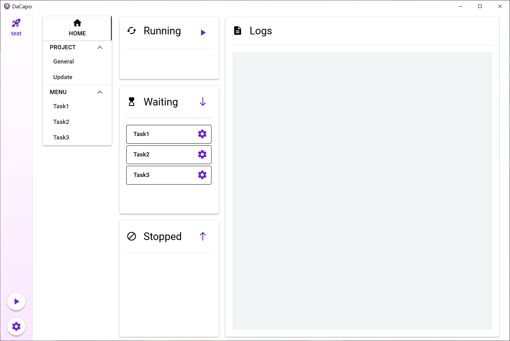

[中文](../README.md) | English

  <h3 align="center">DaCapo</h3>

  

    A graphical script manager driven by configuration files
  

## Introduction

This project aims to provide a graphical interface for programs with complex user configurations. Developers do not need to write additional code, but only need to provide and use configuration files according to specific requirements to create a GUI for their programs. At the same time, for users, it allows for centralized management of multiple program scripts, which is very suitable for tasks that require periodic execution.

## Highlights

- Generate GUI from JSON/YAML format configuration files
- Manage and run multiple task instances with one click
- Automatically pull code from remote repositories and create interfaces
- Automatically manage Python virtual environments and update dependencies
- Support for multiple languages

## Guide

How to make my program compatible with DaCapo? 👉 [Developer Guide](./DeveloperGuide.md)

How to use DaCapo? 👉 [User Guide](./UserGuide.md)

**Examples:**

1. [DaCapoDemo](https://github.com/Aues6uen11Z/DaCapoExample): A simple introductory example
2. [HonkaiHelper](https://github.com/Aues6uen11Z/HonkaiHelper): Automation script for Honkai Impact 3rd

## Installation

#### Obtain the Release Version

You can download the latest release version [here](https://github.com/Aues6uen11Z/DaCapo/releases). Click the executable file to use.

#### Building from Source Code

1. Prepare dependencies like Go, NPM, WebView2, and Wails according to the [installation guide](https://wails.io/docs/gettingstarted/installation/), until the `wails doctor` command shows everything is ready.
2. Clone this project.
3. Run `wails build` in the root directory.

## Acknowledgements

[SRC](https://github.com/LmeSzinc/StarRailCopilot)/[ALAS](https://github.com/LmeSzinc/AzurLaneAutoScript): Where it all began, this project references their page layout and configuration file approach.

[Wails](https://wails.io/): A lighter packaging tool than Electron, converting web projects into PC clients.
