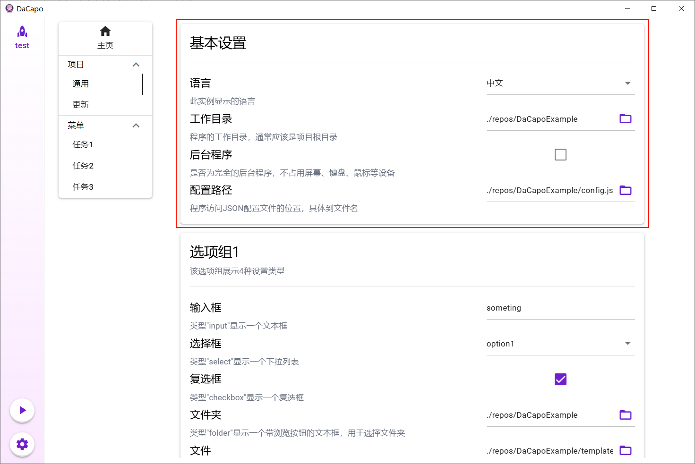
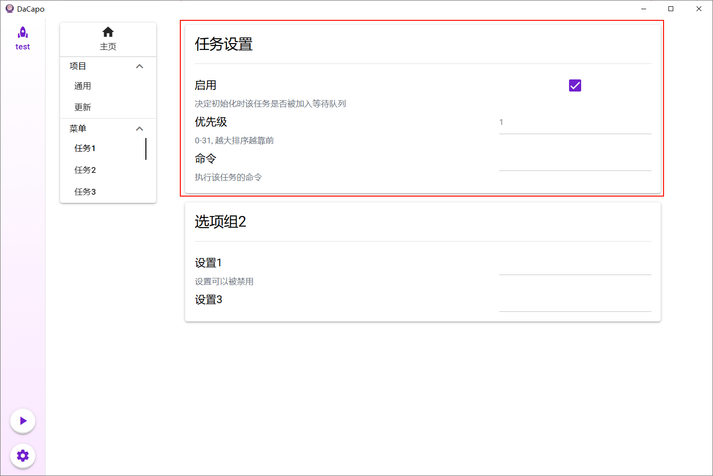
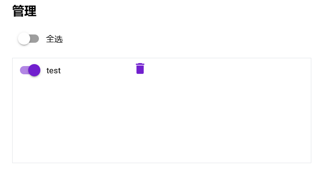

## Table of Contents

- [Create Instance](#create-instance)
  - [Create from Local](#create-from-local)
  - [Create from Existing Template](#create-from-existing-template)
  - [Create from Remote](#create-from-remote)
- [Global Settings](#global-settings)
- [Task Settings](#task-settings)
- [Start Running](#start-running)

## Create Instance

### Create from Local

1. Click the gear icon in the bottom left corner to enter the settings page.
2. In the "Create New Instance" section, select "Create from Local".
3. Fill in the instance name and template name.
4. Browse local files to select the **directory** containing the layout parameter file.
5. Click "Create" in the bottom right corner.

### Create from Existing Template

1. Click the gear icon in the bottom left corner to enter the settings page.
2. In the "Create New Instance" section, select "Create from Existing Template" and choose the corresponding template.
3. Enter the instance name.
4. Click "Create" in the bottom right corner.

### Create from Remote

1. Click the gear icon in the bottom left corner to enter the settings page.
2. In the "Create New Instance" section, select "Create from Remote".
3. Fill in the instance name, template name, repository address, branch to pull, etc.
4. The local path refers to the target **directory** where the remote repository will be cloned, and the template path refers to the path of the template file relative to the repository root.
5. Click "Create" in the bottom right corner.

## Global Settings

Enter the first task group's first task page, which corresponds to the "General" task. Pay special attention to the "Basic Settings" group.

## Task Settings

Then, starting from the second task group, set all task items, paying special attention to the "Task Settings" group. Changes to enablement and priority settings will take effect on the next startup.

## Start Running

After all settings are completed, return to the homepage and check if the order of tasks in the waiting queue is appropriate. If you want to adjust, you can manually adjust the task order or move tasks to the termination queue. Tasks in the termination queue will no longer be executed.

Once everything is ready, click the start button on the right side of the "Run" card to start a single instance. If there are multiple instances, you can execute them all at once using the start button in the left column. In this case, all foreground instances will be executed sequentially, and background instances will be executed concurrently. Foreground and background refer to whether the tasks in the instance occupy screen, keyboard, mouse, and other devices, and whether they can be fully executed in the background.

Note that an instance must be set to ready to be included in the one-click run.

You can observe the task execution status through the log panel, and the `logs/dacapo.log` file will also record some coarse-grained information.
