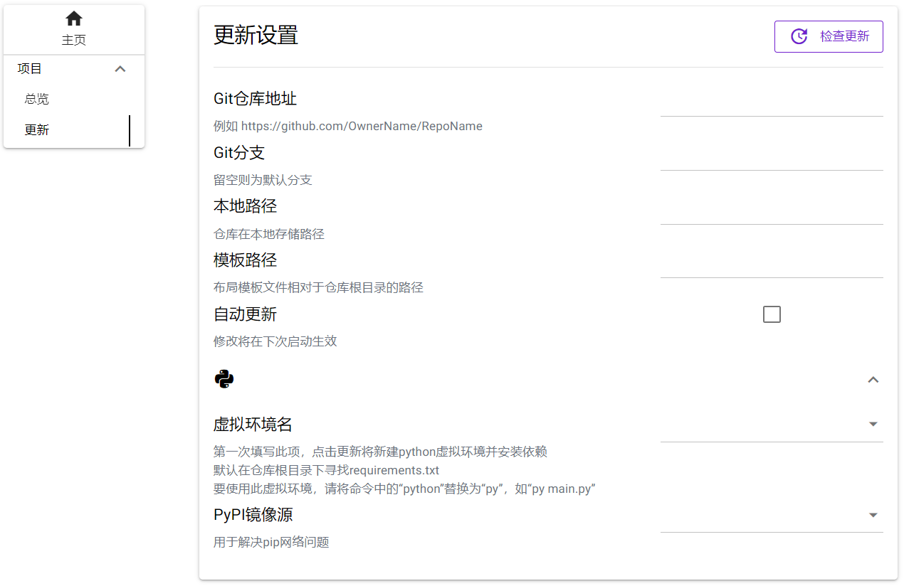

## 目录
- [快速开始](#快速开始)
  - [自定义界面](#自定义界面)
  - [读取用户设置](#读取用户设置)

- [进阶](#进阶)
  - [多语言和帮助](#多语言和帮助)
  - [启用更新](#启用更新)
  - [预定义基本选项组](#预定义基本选项组)

## 快速开始

### 自定义界面

你需要提供一个配置模板，目前支持`JSON`/`YAML`/`TOML`三种格式的配置文件（后两种要能完全等价转换为JSON）。目前来说，它应该是这样的结构，只有一个布局参数文件：

```
----Template/		# 该命名不重要
    |----args.yaml
```

该文件包含所有需要生成的配置内容，一共分为4级，分别代表任务组、任务、选项组、选项，其中**任务**是命令执行的单位。

第一个任务组用来做一些总体设置，其中**必须**包含一个"General"任务，而第一个任务组的所有任务都不会进入执行队列，你应该把要执行的任务的设置项放到后面的任务组中。

选项`argument`目前支持3种类型，分别是`input`输入框，`select`下拉框以及`checkbox`复选框。

> 注意，DaCapo不提供对input输入框内容的数据校验，你需要在自己的程序中处理可能的异常。


理解了各级元素的意义后，就可以编写自己的布局参数了，其中`type`和`value`分别指类型和默认值。

```yaml
# args.yaml

Project:	# menu
    General:	# task
        Group1:		# group
            setting1:	# argument
                type: input
                value: someting
            setting2:
                option:
                - option1
                - option2
                - option3
                type: select
                value: option1
            setting3:
                type: checkbox
                value: true
```

### 读取用户设置

为了让用户自由创建多个实例，修改后的设置并不保存在`args.xxxx`中，上述布局参数只是一个模板，具体的内容是由它派生出的实例配置。

你的程序应该接收一个**json**配置文件（注意不支持YAML/TOML），这次省略了任务组，层级为`Task`任务-`Group`选项组-`Argument`选项，形式如下：

```json
{
    "_info": {...},
    "General": {
        "Group1": {
            "setting1": "someting",
            "setting2": "option1",
            "setting3": true
        },
        "Group2": {
            "setting1": "someting",
        }
    },
    "Task1": {
        "Group3": {
            "setting1": "someting",
        }
    }
}
```

这里删除了类型、选项列表等信息，可以直接读取为多层哈希表（字典）。

接着你需要为每一个任务设置一个执行命令，这也是DaCapo实际调用程序的方式——命令行执行。

## 进阶

### 多语言和帮助

如果你需要给自己的程序添加多语言支持，或者只是给选项写一些解释，就需要添加一个`i18n`目录：

```
----Template/
    |----args.yaml
    |----i18n/
         |----zh-CN.yaml
         |----en-US.yaml
         |----......
```

虽然很怪，但翻译文件是这样组织的：

- 第一层分别是Menu任务组、Task任务、以及所有Group选项组。

```yaml
# i18n/zh-CN.yaml

Menu: ...
Task: ...
Group1: ...
Group2: ...
Group3: ...
```

- 第二层，对于Menu和Task来说是是任务组名、任务名的翻译。

```yaml
# i18n/zh-CN.yaml

Menu:
    Project:
        name: 总览
    Type1:
        name: 类型1
Task:
    General:
        name: 全局设置
    Task1:
        name: 任务1
```

而对于Group来说既包含了该Group的翻译（_info）也包含了其下所有设置项的翻译，若设置项为下拉框，则直接在name和help同级翻译所有选项。

```yaml
# i18n/zh-CN.yaml

Group1:
    _info:
        help: 组1的帮助信息
        name: 组1
    setting1:
        help: 设置项1的帮助信息，input类型只需填写name和help，help也可省略
        name: 设置项1
    setting2:
        help: 设置项2的帮助信息，select类型需填写所有下拉框选项翻译
        name: 设置项2
        option1: 选项1
        option2: 选项2
        option3: 选项3
    setting3:
        help: 设置项3的帮助信息，checkbox类型只需填写name和help，help也可省略
        name: 设置项3
```

### 启用更新

如果你的仓库是开源到Github等平台的公开仓库，且项目使用python这类可以通过源代码更新的语言，你可以开启更新设置页面。非常简单，只要在布局参数文件中加一行：

```yaml
# args.yaml

Project:	# 第一个任务组
    General: {}
    Update: {}	# 名字必须为Update
```

效果如图



如果正好是python项目，还可以让DaCapo来管理python虚拟环境，你要做的只是在仓库根目录放一个`requirements.txt`指定依赖包列表。

### 预定义基本选项组

你可能发现了，界面上出现了自己没写在布局参数文件的选项组，这些选项组被称为“基本选项组”。如果你需要预定义其内容，甚至设置其不可修改来防止小白用户误触，可以在args.xxxx中编辑他们。

目前基本选项有：

- Project（第一个任务组）

  - General
    - language：语言
    - work_dir：工作目录
    - work_dir_enabled：设置上条可编辑性，下同
    - is_background：是否为后台任务
    - is_background_enabled
    - config_path：配置文件路径
    - config_path_enabled
  - Update
    - repo_url：远程仓库地址
    - repo_url_enabled
    - branch：Git仓库分支
    - branch_enabled
    - local_path：仓库在本地存储路径
    - local_path_enabled
    - template_path：布局参数文件相对于仓库根目录的路径
    - template_path_enabled
    - auto_update：是否启用自动更新
    - env_name：虚拟环境名
    - pip_mirror：Pypi镜像源

- Menu（其他实际任务组）

  - Task（对所有任务）

    - priority：任务优先级

    - priority_enabled

    - command：执行该任务的命令

    - command_enabled

      

修改这些选项的方法是在相应的任务下添加一个"_Base"选项组，直接填写值就行了，例如

```yaml
# args.yaml

Project:
    General:
        _Base:
            is_background: false
            is_background_enabled: false
```

