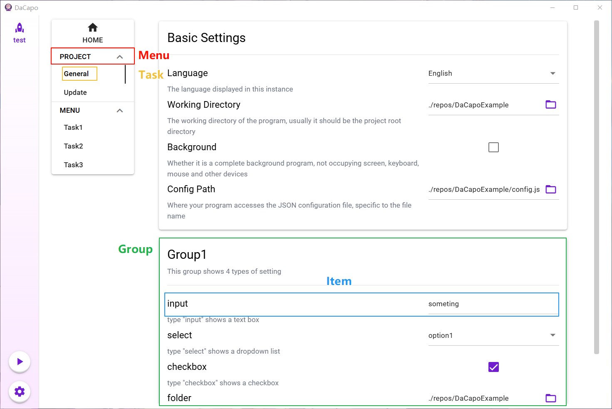
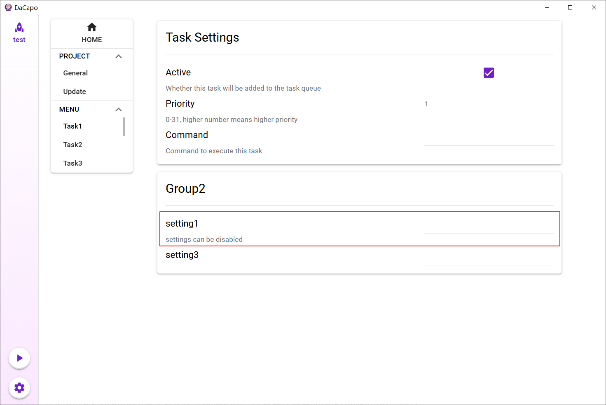
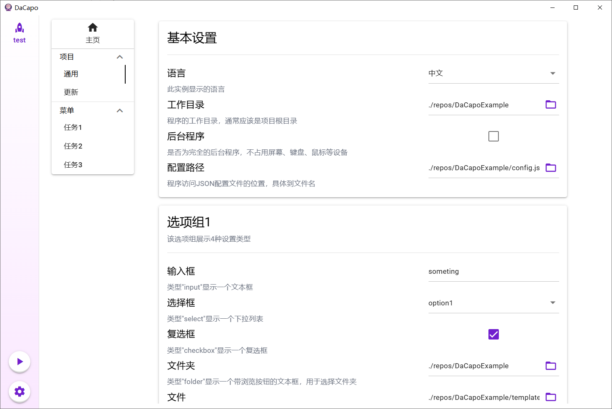
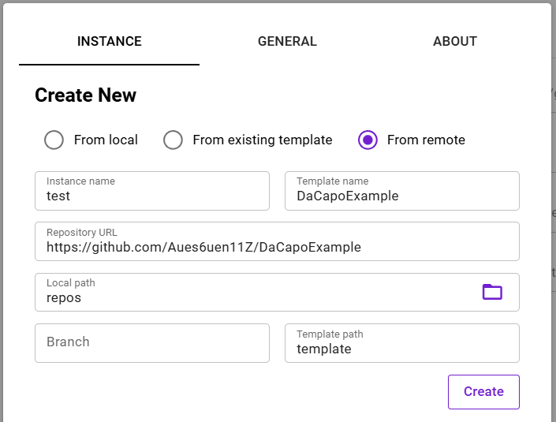
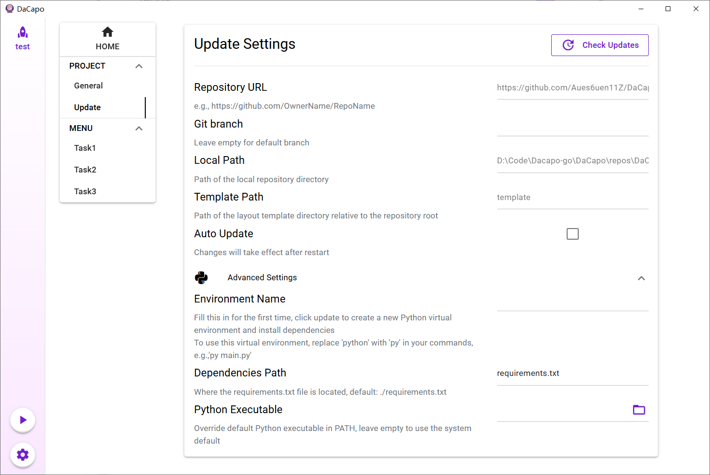

## 目录
- [快速开始](#快速开始)
  - [自定义界面](#自定义界面)
  - [读取用户设置](#读取用户设置)

- [进阶](#进阶)
  - [多语言](#多语言)
  - [远程仓库更新](#远程仓库更新)
  - [预定义基本设置组](#预定义基本设置组)

## 快速开始

### 自定义界面

你需要提供一个配置模板，目前支持`JSON`/`YAML`两种格式，文件名必须是”template“：

```
----Template/		# 该命名不重要
    |----template.yml
```

该文件包含所有需要生成的配置内容，一共分为4级，分别代表任务组Menu、任务Task、设置组Group、设置Item，其中**任务**是命令执行的单位。



第一个任务组“Project”是特殊的，它有着固定的结构，其任务“General”和“Update"也都不会进入执行队列，你应该把要执行任务的设置项放到后面的任务组中。”General“任务可以添加自定义选项组，像这样：

```yaml
Project:
  General:
    Group1:
      _help:  # 特殊Item，用于显示设置组帮助信息
        value: This group shows 4 types of setting
      input:
        type: input
        value: someting
        help: type "input" shows a text box
```

要生成一个设置项，只需在模板文件中填写其信息，包括：

- type：输入框input、下拉框select、复选框checkbox、目录输入folder、文件输入file 5种类型之一
- value：默认值
- help：帮助信息
- option：选项，仅在type为select时生效
- hidden：是否隐藏该设置项，当一个Group的所有Item都隐藏时，该Group也会被隐藏
- disabled：是否不可编辑

>  注意，DaCapo不提供对输入内容的校验，你需要在自己的程序中处理可能的异常。

按照Menu-Task-Group-Item的结构自由组织你的模板，就可以得到对应的页面，具体可以参考[该仓库](https://github.com/Aues6uen11Z/DaCapoExample)，简单示例如下：

```yaml
Menu:
  Task1:
    Group2:
      setting1:
        value: ""
        type: input
        help: settings can be disabled
        disabled: true
```



### 读取用户设置

为了让用户自由创建多个实例，修改后的设置并不保存在`template.xxxx`中，上述布局参数只是一个模板，具体的内容是由它派生出的实例配置。

你的程序应该接收一个**json**配置文件（注意不支持YAML/TOML），形式依然是四层结构，但删除了类型、选项列表等信息，可以直接读取为多层哈希表（字典）：

```json
{
  "Project": {
    "General": {
      "Group1": {
        "input": "someting",
        "select": "option1",
        "checkbox": true,
        "folder": "./repos/DaCapoExample",
        "file": "./repos/DaCapoExample/template/template.yml"
      }
    }
  },
  "Menu": {
    "Task1": {
      "Group2": {
        "setting1": "1",
        "setting2": "2",
        "setting3": "3"
      }
    },
    "Task2": {
      "Group3": {
        "setting1": "4",
        "setting2": "5"
      }
    },
    "Task3": {
      "Group4": {
        "setting1": "6"
      }
    }
  }
}
```

接着你需要为每一个任务设置一个执行命令，这也是DaCapo实际调用程序的方式——命令行执行，所以要千万注意命令本身的安全性。

## 进阶

### 多语言

如果你需要给自己的程序添加多语言支持，就需要添加一个`i18n`目录，存放翻译json文件：

```
----Template/
    |----template.yaml
    |----i18n/
         |----中文.json
         |----English.json
         |----......
```

翻译文件是这样组织的：

```json
{
  "Menu": {
    "name": "菜单",
    "tasks": {
      "Task1": {
        "groups": {
          "Group2": {
            "help": "",
            "items": {
              "setting1": {
                "help": "设置可以被禁用",
                "name": "设置1"
              },
......
```

虽然看起来很麻烦，但不用担心，如果你懒得手写，可以很方便地用[python脚本](https://github.com/Aues6uen11Z/DaCapoExample/blob/master/gen_i18n.py)通过template文件导出翻译文件。

最终通过界面上的语言设置无缝切换显示语言



### 远程仓库更新

如果你的仓库是开源到Github等平台的公开仓库，且项目使用python这类可以通过源代码更新的语言，你可以选择从远程创建实例，创建完会自动出现更新界面。





若项目恰好使用python，还可以设置虚拟环境名和依赖文件位置，点击更新会自动创建虚拟环境并安装依赖。默认情况下使用系统变量指向的python，若需要不同版本可以填入具体的python可执行文件路径。

### 预定义基本设置组

你可能发现了，界面上出现了自己没写在布局参数文件的选项组，这些选项组被称为“基本选项组”。如果你需要预定义其内容，甚至设置其不可修改来防止小白用户误触，可以在template文件中编辑他们。

目前基本选项有：

- Project（第一个任务组）

  - General
    - language：语言
    - work_dir：工作目录
    - background：是否为后台任务
    - config_path：配置文件路径，实例的具体设置保存在根目录instances目录下，修改该项将创建一个软链接到config_path
  - Update
    - auto_update：是否启用自动更新
    - env_name：虚拟环境名
    - deps_path：python依赖库文件相对于仓库根目录的路径
    - python_exec：创建虚拟环境用的python可执行文件，主要用于对python版本有要求的情况
- Menu（其他实际任务组）

  - Task（对所有任务）
- active：是否启用，决定启动时该任务是否被加入等待队列
    - priority：任务优先级，决定启动时该任务在等待队列的位置
- command：执行该任务的命令

修改这些选项的方法是在相应的任务下添加一个"_Base"选项组，例如

```yaml
# template.yaml

Project:
    General:
        _Base:
            work_dir:
            	value: ./repos/DaCapoExample
            	disabled: true
```
