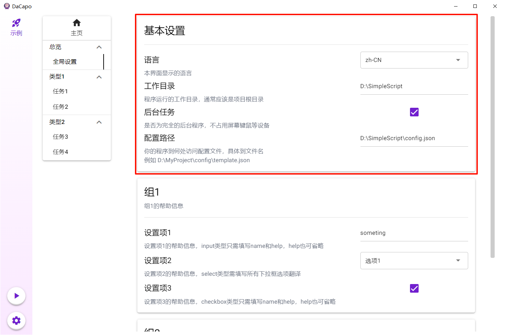
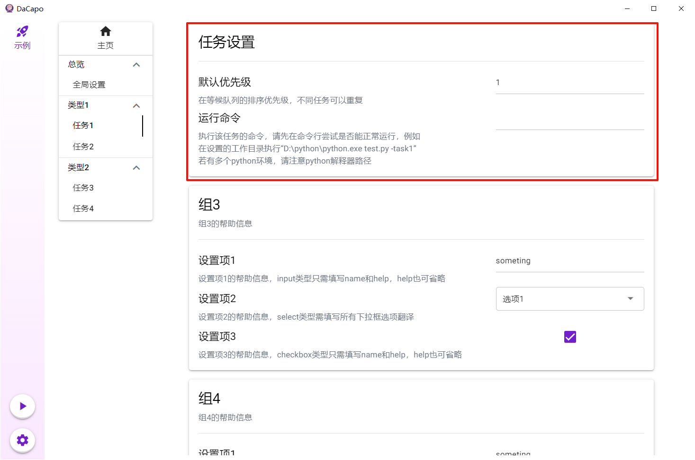

## 目录
- [创建实例](#创建实例)
  - [从已有模板创建](#从已有模板创建)
  - [从本地导入](#从本地导入)
  - [从远程仓库拉取](#从远程仓库拉取)
- [全局设置](#全局设置)
- [任务设置](#任务设置)
- [开始运行](#开始运行)
- [注意事项](#注意事项)

## 创建实例

### 从已有模板创建

1. 点击左下角齿轮图标进入设置页面
2. 在“添加新实例”处选择”从已有模板创建“，选择对应模板
3. 填写实例名
4. 点击右下角“应用”

### 从本地导入

1. 点击左下角齿轮图标进入设置页面
2. 在“添加新实例”处选择”导入“，浏览本地文件选择包含布局参数文件的目录
   >  注意不要点进该目录，目前文件浏览器无法返回上一级，点过头了只能重新选

1. 填写实例名@模板名
2. 点击右下角“应用”

### 从远程仓库拉取

1. 按[从已有模板创建](从已有模板创建)的说明创建一个“Init”模板的实例
2. 在“更新”页面填写各设置项，若目标是符合要求的python项目，可以填写有关python的设置。
3. 点击右上角“检查更新”（若从Github拉取仓库，需要自行保证网络畅通）
4. 待更新完毕后重启DaCapo

## 全局设置

进入第一个任务组的第一个任务页面，也就是“General”任务对应的页面，重点注意“基本设置”一组。

## 任务设置

随后从第二个任务组开始，设置所有任务项，重点注意“任务设置”组。其中默认优先级数字越小优先级越高，修改将在下次启动时生效。

## 开始运行

所有设置完成后回到主页，检查等待队列中任务的顺序是否合适，若还想调整可以手动点击任务将其移动到终止队列，终止队列的任务将不再执行。

一切就绪后点击“运行”卡片右侧的开始按钮将开始单个实例；有多个实例时可以通过左栏开始按钮一键执行，此时所有前台实例顺序执行，后台实例并发执行。所谓前后台指的是这个实例包含的任务是否占用屏幕键鼠等设备，能否完全后台执行。

任务执行情况可以通过日志面板观察，`dacapo.log`文件也会记录一些粗粒度信息。

## 注意事项

不要在有任务运行的时候创建删除实例、修改就绪状态、从远程仓库更新，这些操作会刷新界面或要求重启，导致任务运行中断。