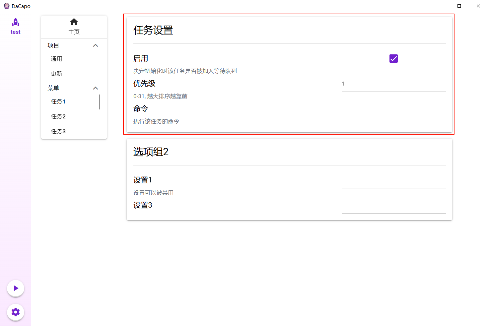

## 目录
- [创建实例](#创建实例)
  - [从本地创建](#从本地创建)
  - [从现有模板创建](#从现有模板创建)
  - [从远程创建](#从远程创建)
  
- [通用设置](#通用设置)
- [任务设置](#任务设置)
- [开始运行](#开始运行)

## 创建实例

### 从本地创建

1. 点击左下角齿轮图标进入设置页面
2. 在“创建新实例”处选择”从本地创建“
3. 填写实例名和模板名
4. 浏览本地文件选择包含布局参数文件的**目录**
5. 点击右下角“创建”

### 从现有模板创建

1. 点击左下角齿轮图标进入设置页面
2. 在“创建新实例”处选择”从现有模板创建“，选择对应模板
3. 填写实例名
4. 点击右下角“创建”

### 从远程创建

1. 点击左下角齿轮图标进入设置页面
2. 在“创建新实例”处选择”从远程创建“
3. 填写实例名、模板名、仓库地址、要拉取的分支等
4. 本地路径指远程仓库克隆到的目标**目录**，模板路径指template文件相对于仓库根目录的路径
5. 点击右下角“创建”

## 通用设置

进入第一个任务组的第一个任务页面，也就是“General”任务对应的页面，重点注意“基本设置”一组。

## 任务设置

随后从第二个任务组开始，设置所有任务项，重点注意“任务设置”组。其中启用和优先级设置的修改将在下次启动时生效。

## 开始运行

所有设置完成后回到主页，检查等待队列中任务的顺序是否合适，若还想调整可以手动调整任务顺序或移动到终止队列，终止队列的任务将不再执行。

一切就绪后点击“运行”卡片右侧的开始按钮将开始单个实例；有多个实例时可以通过左栏开始按钮一键执行，此时所有前台实例顺序执行，后台实例并发执行。所谓前后台指的是这个实例包含的任务是否占用屏幕键鼠等设备，能否完全后台执行。

注意要设置为就绪才会被一键运行

任务执行情况可以通过日志面板观察，`logs/dacapo.log`文件也会记录一些粗粒度信息。
