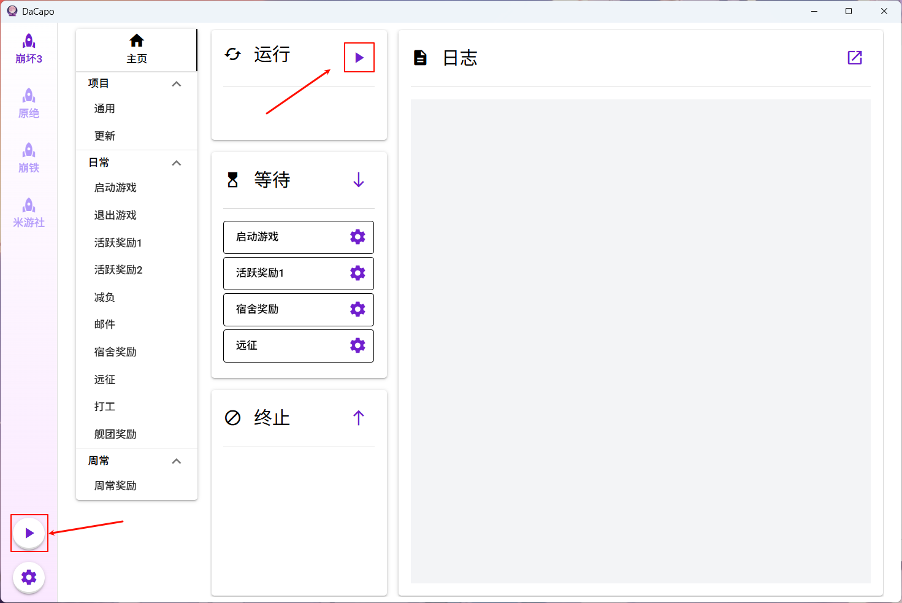
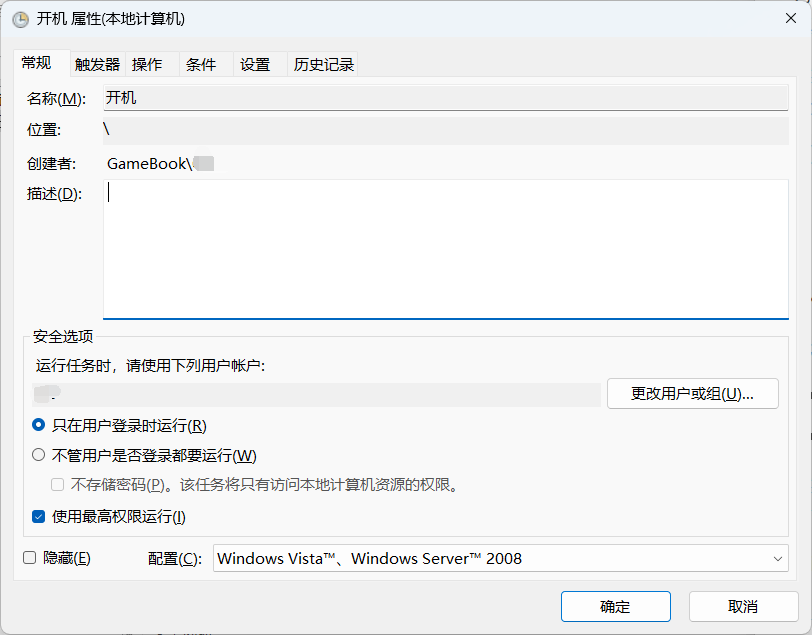
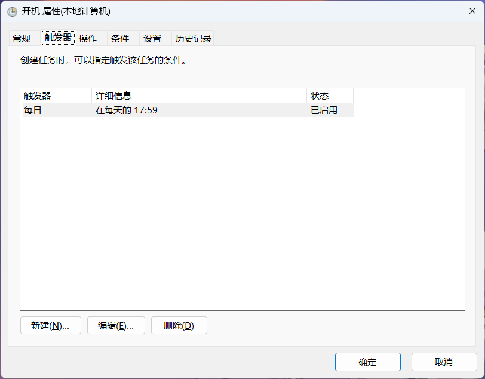
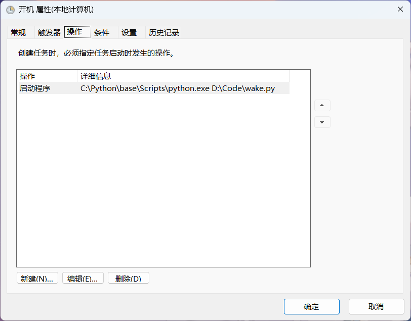
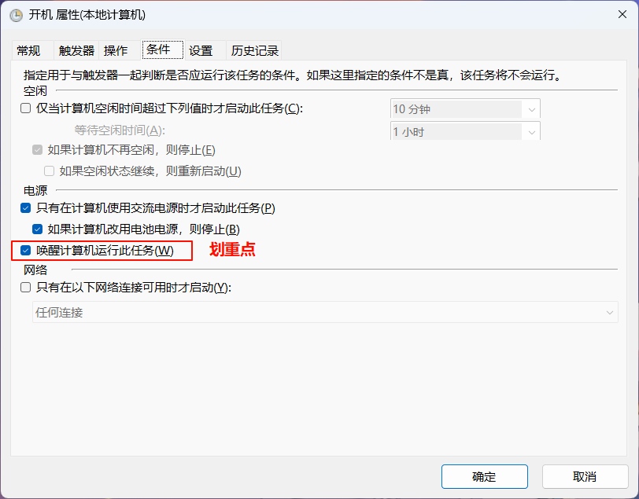
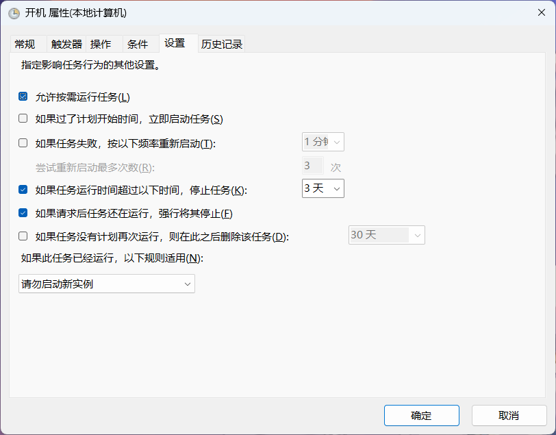
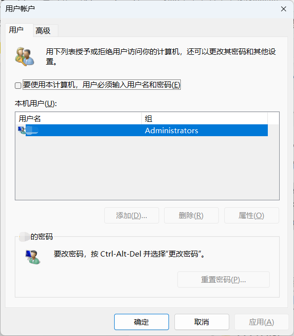
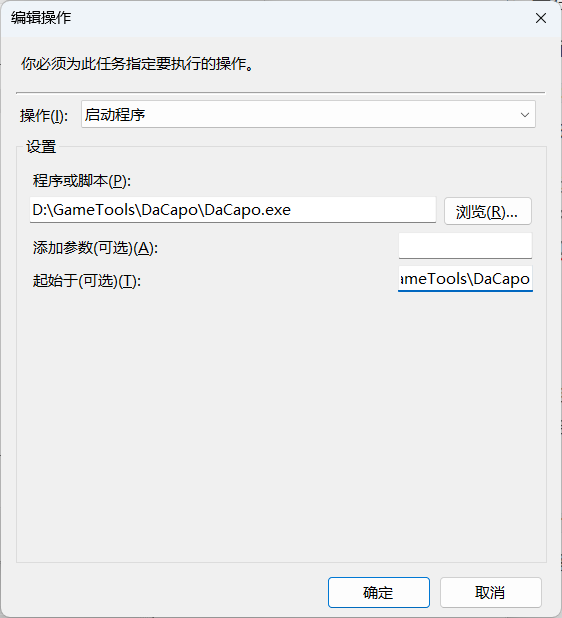

到目前为止，我理想中DaCapo所有的主要功能都已具备，通过它实现了自动开机-刷完日常-自动关机的每日循环，不用再把时间浪费在重复枯燥的副本上了。

现在来分享一下我的使用姿势，可供参考。

## 1. 软件安装

[下载](https://github.com/Aues6uen11Z/DaCapo/releases)最新版DaCapo，目前仅支持Windows，根据发布版类型安装或解压即可。

> 如果你纠结用哪种，我建议用portable免安装版，干净又方便

## 2. 脚本获取

DaCapo 支持通过 Git 仓库远程加载脚本模板，目前支持的脚本包括：

*   [崩坏3](https://github.com/Aues6uen11Z/HonkaiHelper)——HonkaiHelper原生支持
*   [原神绝区零鸣潮](https://github.com/Aues6uen11Z/GameScripts)——依赖BetterGI、ZenlessZoneZero-OneDragon、ok-ww，未适配需要下载本体
*   [崩坏：星穹铁道](https://github.com/Aues6uen11Z/DaCapo-SRC-Adapter)——依赖StarRailCopilot，已适配无需下载本体
*   [米游社](https://github.com/Womsxd/MihoyoBBSTools)——MihoyoBBSTools原生支持

当然扩展更多脚本也是很容易的，有想法的可以积极尝试\~

按照各项目的说明完成实例创建和基本设置，每个手动运行一次，看是否正常。

## 3. 定时启停

DaCapo 提供了两种运行方式：

*   **单个运行按钮**：运行指定实例
*   **调度器按钮（左下角）** ：运行所有已启用的实例



调度策略如下：

*   **前台实例**（占用键鼠）按顺序串行执行
*   **后台实例**（崩铁和米游社签到）并行执行

进入设置页面，将所有实例设为“已启用”，然后点击调度器按钮即可一键运行。


为了避免手动打开DaCapo时调度器也自动运行，我选择不开启“启动时运行”，并且在Cron表达式一栏填写`0 18 * * *`，表示每天下午6点运行。

然后选择“调度器结束时”的动作为`休眠`，当然你还可以选择其他动作，但既然我们目标是人不在时自动运行，还是选休眠或关机省点电费吧。


> Tips: 如果你不想所有脚本都同时间段执行，可以单独设置某个实例的Cron表达式，并关闭准备状态以避免被调度器运行，最后选择“在指定时间”设置定时关闭。

## 4. 定时开机

我所了解的自动开机方法有两种，均需要bios支持，具体方法根据主板型号自行搜索：

*   通电自动开机——需要定时或智能插座
*   网络唤醒——需要局域网内有台设备

然而这几个月我手头只有一台笔记本，bios没有这么高的自由度，正当我大失所望准备放弃时，发现还有一种曲线救国方法——休眠。Windows系统的休眠也是断电的，但与关机不同的是可以使用任务计划程序从休眠中唤醒计算机。

经过了一番折腾，遇到的问题不限于无法唤醒、双账户bug、无法自动登录、登录后不亮屏等等，终于是实现了休眠唤醒到进入系统。期间踩过的坑我已经有些不记得了，或许你们也遇不到，直接贴下我的最终配置吧。











其中任务操作执行的`wake.py`的内容如下，动键鼠使屏幕亮起来，如果你进系统屏幕是亮的就不用了。

```python
import pyautogui

pyautogui.moveRel(-100, -100, duration=0.5)
pyautogui.press("escape")

```

接下来还要设置免密码登录，不然会卡在系统登录界面。

0. 确保你有一个Windows账户密码，而不是PIN之类的

1. 点击win+r打开运行，输入`netplwiz`打开用户账户

2. 取消勾选“要使用本计算机，用户必须输入用户名和密码”

   > 若没有此项，按"**WIN+R**"键打开运行，输入"**regedit**"后打开注册表，然后按如下路径找到：
   >
   > **HKEY\_LOCAL\_MACHINE** -> **SOFTWARE** -> **Microsoft** -> **Windows NT** -> **CurrentVersion** -> **PasswordLess** -> **Device** -> **DevicePasswordLessBuildVersion**
   >
   > 把它的值由2改成0，保存即可。



## 5. DaCapo自启动

之前的步骤中我们确保了软件运行时能够自动调度实例，但还要解决软件本身的启动问题。目前DaCapo不支持简单点一下“开机自启”之类的选项，还需要自己来完成，不过这很简单。

开机自启的几种方式：

*   点击win+r打开运行，输入`shell:startup`，创建DaCapo.exe的快捷方式并复制到该处。
*   任务计划程序创建一个任务，触发器选择“启动时”，操作选择“启动程序”并填写DaCapo.exe路径，同时“起始于”填写DaCapo根目录。



-   修改注册表，自行查阅方法。

至于之前采用休眠唤醒方式的，我的建议是用任务计划程序设置定时启动程序，时间稍晚于唤醒时间。

***

至此，一切都安排妥当，可以当甩手掌柜了。不得不感慨，玩的二游越多，需要浪费在日常上的时间就越多，每天拯救几十分钟的光阴还是有必要的。


目前软件适配的游戏脚本还不多，欢迎大家提供更多适配，我也会积极配合的。

最后，对你有帮助的话别忘了给项目点个Star\~
